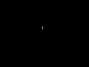
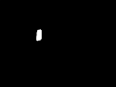
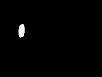
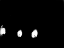
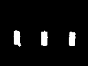
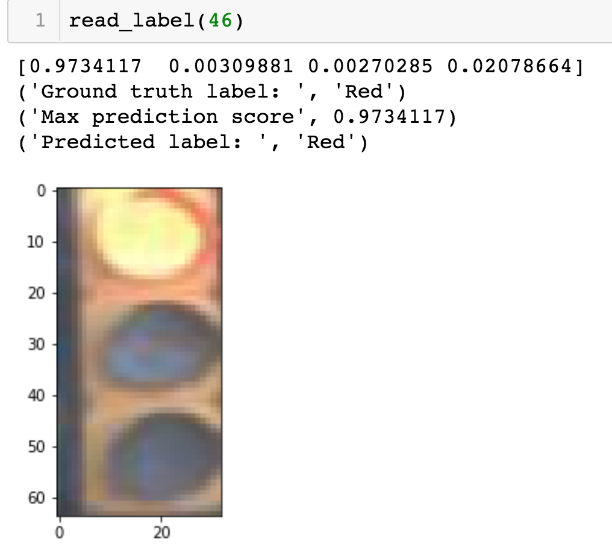
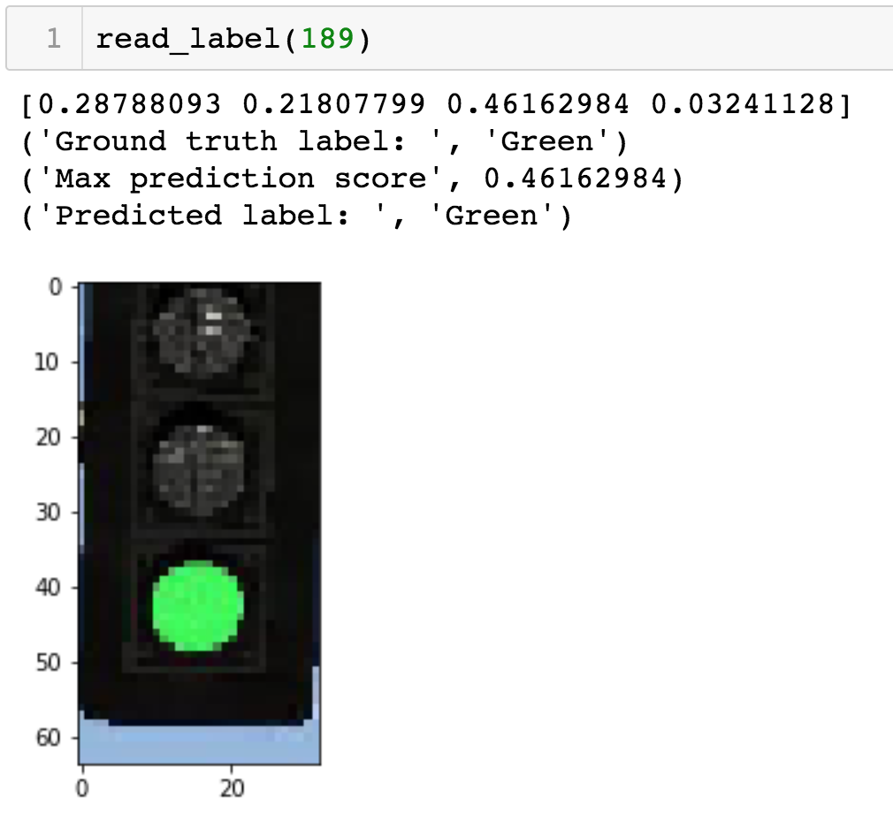

## Traffic Light Detector and Classifier

This project is a Part of the CarND Capstone project.

I am a part of the team `Bos-Robo-Car` and was assigned a task to detect and classify a traffic light color on the 
incoming images from Simulator or from Carla (Udacity Self Driving Car).

* First part of the project is to Detect the traffic light on the incoming image.
* Second part fo the project is to Classify the traffic light color on the detected traffic light.

## Traffic Light Detector

The project is aimed at detecting traffic light on the incoming picture either from Simulator or from Carla.

For the traffic light detection I've used a previously trained model and weights from [Kaggle Ultrasound Nerve Segmentation](https://github.com/ooleksyuk/kaggle-ultrasound-nerve-segmentation).

The weights are located in `weights.h5`. Data for training was provided by Udacity from ros bag (traffic_light_bag_files). It's ignored because files can be downloaded from Udacity website and unpack using RosBag instructions.

I've used a pre-trained model that looks like this 

```bash
____________________________________________________________________________________________________
Layer (type)                     Output Shape          Param #     Connected to
====================================================================================================
input_1 (InputLayer)             (None, 96, 128, 1)    0
____________________________________________________________________________________________________
conv2d_1 (Conv2D)                (None, 96, 128, 32)   320         input_1[0][0]
____________________________________________________________________________________________________
conv_1_2 (Conv2D)                (None, 96, 128, 32)   9248        conv2d_1[0][0]
____________________________________________________________________________________________________
maxpool_1 (MaxPooling2D)         (None, 48, 64, 32)    0           conv_1_2[0][0]
____________________________________________________________________________________________________
conv_2_1 (Conv2D)                (None, 48, 64, 64)    18496       maxpool_1[0][0]
____________________________________________________________________________________________________
conv_2_2 (Conv2D)                (None, 48, 64, 64)    36928       conv_2_1[0][0]
____________________________________________________________________________________________________
maxpool_2 (MaxPooling2D)         (None, 24, 32, 64)    0           conv_2_2[0][0]
____________________________________________________________________________________________________
conv_3_1 (Conv2D)                (None, 24, 32, 128)   73856       maxpool_2[0][0]
____________________________________________________________________________________________________
conv_3_2 (Conv2D)                (None, 24, 32, 128)   147584      conv_3_1[0][0]
____________________________________________________________________________________________________
maxpool_3 (MaxPooling2D)         (None, 12, 16, 128)   0           conv_3_2[0][0]
____________________________________________________________________________________________________
conv_4_1 (Conv2D)                (None, 12, 16, 256)   295168      maxpool_3[0][0]
____________________________________________________________________________________________________
conv_4_2 (Conv2D)                (None, 12, 16, 256)   590080      conv_4_1[0][0]
____________________________________________________________________________________________________
maxpool_4 (MaxPooling2D)         (None, 6, 8, 256)     0           conv_4_2[0][0]
____________________________________________________________________________________________________
conv_5_1 (Conv2D)                (None, 6, 8, 512)     1180160     maxpool_4[0][0]
____________________________________________________________________________________________________
conv_5_2 (Conv2D)                (None, 6, 8, 512)     2359808     conv_5_1[0][0]
____________________________________________________________________________________________________
convtran_6 (Conv2DTranspose)     (None, 12, 16, 256)   524544      conv_5_2[0][0]
____________________________________________________________________________________________________
up_6 (Concatenate)               (None, 12, 16, 512)   0           convtran_6[0][0]
                                                                   conv_4_2[0][0]
____________________________________________________________________________________________________
conv_6_1 (Conv2D)                (None, 12, 16, 256)   1179904     up_6[0][0]
____________________________________________________________________________________________________
conv_6_2 (Conv2D)                (None, 12, 16, 256)   590080      conv_6_1[0][0]
____________________________________________________________________________________________________
convtran_7 (Conv2DTranspose)     (None, 24, 32, 128)   131200      conv_6_2[0][0]
____________________________________________________________________________________________________
up_7 (Concatenate)               (None, 24, 32, 256)   0           convtran_7[0][0]
                                                                   conv_3_2[0][0]
____________________________________________________________________________________________________
conv_7_1 (Conv2D)                (None, 24, 32, 128)   295040      up_7[0][0]
____________________________________________________________________________________________________
conv_7_2 (Conv2D)                (None, 24, 32, 128)   147584      conv_7_1[0][0]
____________________________________________________________________________________________________
convtran_8 (Conv2DTranspose)     (None, 48, 64, 64)    32832       conv_7_2[0][0]
____________________________________________________________________________________________________
up_8 (Concatenate)               (None, 48, 64, 128)   0           convtran_8[0][0]
                                                                   conv_2_2[0][0]
____________________________________________________________________________________________________
conv_8_1 (Conv2D)                (None, 48, 64, 64)    73792       up_8[0][0]
____________________________________________________________________________________________________
conv_8_2 (Conv2D)                (None, 48, 64, 64)    36928       conv_8_1[0][0]
____________________________________________________________________________________________________
convtran_9 (Conv2DTranspose)     (None, 96, 128, 32)   8224        conv_8_2[0][0]
____________________________________________________________________________________________________
up_9 (Concatenate)               (None, 96, 128, 64)   0           convtran_9[0][0]
                                                                   conv_1_2[0][0]
____________________________________________________________________________________________________
conv_9_1 (Conv2D)                (None, 96, 128, 32)   18464       up_9[0][0]
____________________________________________________________________________________________________
conv_9_2 (Conv2D)                (None, 96, 128, 32)   9248        conv_9_1[0][0]
____________________________________________________________________________________________________
conv2d_2 (Conv2D)                (None, 96, 128, 1)    33          conv_9_2[0][0]
====================================================================================================
Total params: 7,759,521
Trainable params: 7,759,521
Non-trainable params: 0
```

Model has been trained using
```python
IMAGE_ROWS = 96
IMAGE_COLS = 128
COLORS = 3
SMOOTH = 1.
ACTIVATION = 'relu'
PADDING = 'same'
KERNEL_SIZE = (3, 3)
STRIDES = (2, 2)
```

Last epoch training on Carla data
```python
Train on 153 samples, validate on 39 samples

Epoch 30/30
153/153 [==============================] - 183s - loss: -0.3256 - dice_coef: 0.3256 - val_loss: -0.2416 - val_dice_coef: 0.2416
```

Last epoch training on Simulator data
```python
Train on 89 samples, validate on 23 samples

Epoch 30/30
89/89 [==============================] - 87s - loss: -0.5558 - dice_coef: 0.5558 - val_loss: -0.4949 - val_dice_coef: 0.4949
```

Models are being saved into `carla` and `sim` folders respectively. For future use in CarND Capstone I will rename each model to
```bash
tl_detector_carla.h5
tl_detector_sim.h5
```

## Predicted images examples

### Carla









### Simulator







## Traffic light Classifier

The project is aimed at classifying traffic light on the incoming picture either from Simulator or from Carla.

I've used two different models for Simulator and for Carla.

Simulator model summary:
```bash
_________________________________________________________________
Layer (type)                 Output Shape              Param #   
=================================================================
conv2d_3 (Conv2D)            (None, 64, 32, 32)        896       
_________________________________________________________________
max_pooling2d_3 (MaxPooling2 (None, 32, 16, 32)        0         
_________________________________________________________________
conv2d_4 (Conv2D)            (None, 32, 16, 32)        9248      
_________________________________________________________________
max_pooling2d_4 (MaxPooling2 (None, 16, 8, 32)         0         
_________________________________________________________________
flatten_2 (Flatten)          (None, 4096)              0         
_________________________________________________________________
dense_3 (Dense)              (None, 8)                 32776     
_________________________________________________________________
dense_4 (Dense)              (None, 4)                 36        
=================================================================
Total params: 42,956
Trainable params: 42,956
Non-trainable params: 0
_________________________________________________________________
```

Carla model summary:
```bash
_________________________________________________________________
Layer (type)                 Output Shape              Param #   
=================================================================
conv2d_2 (Conv2D)            (None, 64, 32, 32)        896       
_________________________________________________________________
max_pooling2d_2 (MaxPooling2 (None, 32, 16, 32)        0         
_________________________________________________________________
flatten_2 (Flatten)          (None, 16384)             0         
_________________________________________________________________
dense_3 (Dense)              (None, 8)                 131080    
_________________________________________________________________
dense_4 (Dense)              (None, 4)                 36        
=================================================================
Total params: 132,012
Trainable params: 132,012
Non-trainable params: 0
_________________________________________________________________
```
I have trained both models with the following parameters:
```python
epochs=30, 
validation_split=0.1, 
shuffle=True
```
For Simulator I had more data samples and used `batch_size=128` as for Carla was I had to increase `batch_size=256` to predictions.

Here is an example of light color prediction for Carla and Simulator:


